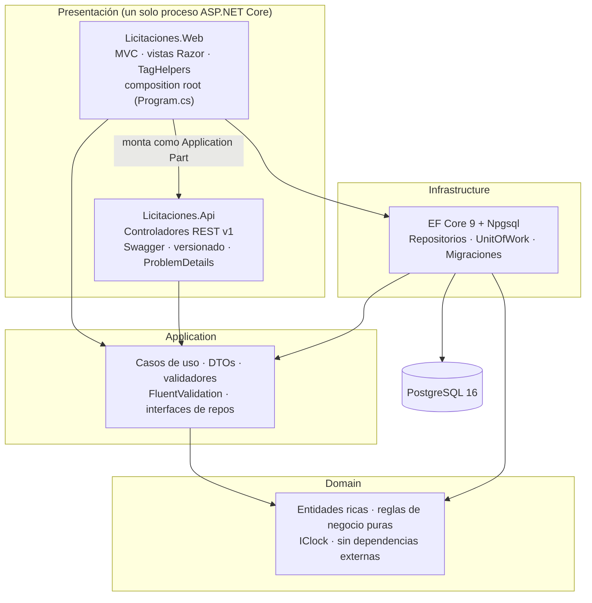

# Arquitectura general

## Monolito modular en capas

La solución sigue Clean/Onion Architecture: las dependencias siempre apuntan hacia
adentro (Domain no depende de nada; Application depende de Domain; Infrastructure y
las capas de presentación dependen de Application y Domain, nunca al revés).

## Por qué un solo proceso para Web y Api

El enunciado (sección 6.2) pide carpetas `Licitaciones.Web` y `Licitaciones.Api`
separadas con responsabilidades distintas, pero la sección 13.1 describe un único
"servicio de aplicación" en `docker-compose`. Se resolvieron ambos requisitos así:

- `Licitaciones.Api` es una **biblioteca de clases** (`Microsoft.NET.Sdk.Web` sin
  `Program.cs` propio) que contiene únicamente controladores REST, configuración de
  versionado y Swagger, y el manejador de excepciones a `ProblemDetails`.
- `Licitaciones.Web` es el **único ejecutable**: su `Program.cs` es el composition
  root que registra Application + Infrastructure + Api, y monta los controladores de
  Api como *Application Part* (`AddApplicationPart`), de modo que un mismo proceso
  Kestrel sirve tanto las vistas MVC como `/api/v1/...`.

Esto mantiene la separación de responsabilidades en el código (dos proyectos con
límites de compilación reales) sin duplicar contenedores, health checks ni
configuración de despliegue. La decisión se registra aquí y en `bitacora-xp.md`
(Iteración 0) porque implica un compromiso de diseño consciente, no un descuido.

## Responsabilidades por proyecto

| Proyecto | Responsabilidad | No hace |
|---|---|---|
| `Licitaciones.Domain` | Entidades con invariantes (constructores/métodos, sin setters públicos), value objects, servicios de dominio puros (`RegistroOfertaService`, `EvaluadorOfertas`, `ResolutorNivelAprobacion`, `ConversorMoneda`), `IClock` | No conoce EF Core, HTTP, ni ningún framework |
| `Licitaciones.Application` | Casos de uso (`*Service`), DTOs de entrada/salida, validación de forma (FluentValidation), interfaces de repositorio/`IUnitOfWork` que Infrastructure implementa | No conoce EF Core ni ASP.NET Core directamente |
| `Licitaciones.Infrastructure` | `DbContext`, configuraciones Fluent API, migraciones, repositorios EF Core, `UnitOfWork`, `SystemClock` | No contiene reglas de negocio |
| `Licitaciones.Api` | Controladores REST, contratos HTTP, versionado, OpenAPI, traducción de excepciones a `ProblemDetails` | No contiene lógica de negocio ni acceso a datos propio |
| `Licitaciones.Web` | Controladores MVC, vistas Razor, TagHelpers, composition root, temas claro/oscuro y CRC/USD | No duplica reglas ya resueltas en Application/Domain |

## Calidad de código

- Controladores delgados: toda la lógica vive en `*Service` de Application o en los
  servicios de dominio; los controladores solo traducen HTTP ↔ DTOs.
- Inyección de dependencias en todas las capas vía `Microsoft.Extensions.DependencyInjection`
  (`AddApplication`, `AddInfrastructure`, `AddApiModule`, cada una en su propio proyecto).
- Sin dependencias no justificadas: cada paquete NuGet agregado tiene un propósito
  documentado (ver `csproj` correspondiente); no hay ORMs ni frameworks duplicados.
- `.editorconfig` + `dotnet format --verify-no-changes` en CI garantizan estándares de
  formato uniformes; `dotnet build /warnaserror` impide advertencias evitables.
- Documentación XML en los servicios de dominio y de aplicación donde la regla de
  negocio no es evidente por el nombre (ver comentarios en `RegistroOfertaService`,
  `ResolutorNivelAprobacion`, etc.).

## Reutilización deliberada

- `PaginacionExtensions.APaginadoAsync` centraliza la paginación para los cinco
  repositorios en vez de repetir `Skip`/`Take`/`Count` cinco veces.
- `LicitacionesWebControllerBase` precarga el tipo de cambio activo una sola vez por
  solicitud MVC (no una consulta por cada monto mostrado en una tabla).
- El TagHelper `<monto>` centraliza el formato es-CR y la conversión CRC/USD en un
  solo lugar, usado por las cinco vistas que muestran dinero.
