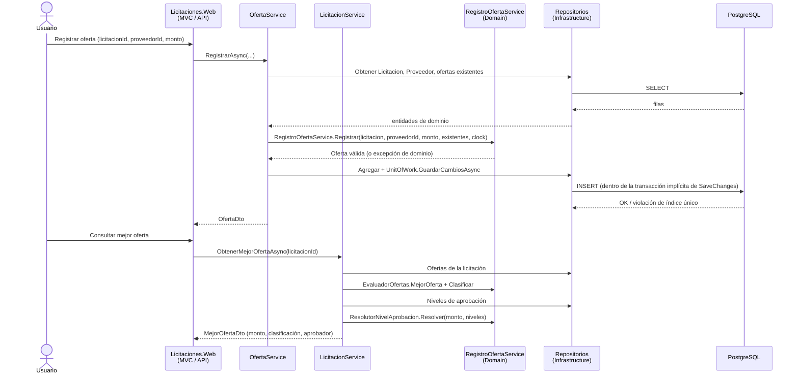

# Integración entre módulos

Cómo cooperan los cinco módulos de negocio y los límites entre las capas técnicas,
complementando `arquitectura-general.md` (que explica la arquitectura en general) con
el flujo real de datos.

## Flujo de extremo a extremo: de una oferta a su aprobador

Puntos clave de este flujo:

- **Ningún controlador (MVC ni API) contiene lógica de negocio.** Ambos llaman al
  mismo `OfertaService`/`LicitacionService` de Application — es el mismo código el que
  se ejecuta sin importar si la solicitud llegó por `/Licitaciones/RegistrarOferta`
  (formulario MVC) o por `POST /api/v1/licitaciones/{id}/ofertas` (API REST).
- **El dominio nunca toca la base de datos.** `RegistroOfertaService` y
  `EvaluadorOfertas` reciben las entidades ya cargadas (por Application, a través de
  los repositorios de Infrastructure) y devuelven resultados o lanzan excepciones —
  por eso se pueden probar con 53 casos unitarios sin PostgreSQL.
- **La resolución del aprobador no está acoplada a Ofertas.** `NivelAprobacion` no
  tiene ninguna relación de clave foránea con `Oferta` ni `Licitacion`: el aprobador se
  calcula on-demand a partir del monto de la mejor oferta, consultando la tabla de
  niveles vigente en ese momento. Si los niveles cambian, las adjudicaciones futuras
  usan la nueva configuración sin ninguna migración de datos.

## Cómo cooperan los cinco módulos

| Desde | Hacia | Cómo |
|---|---|---|
| Licitaciones | Ofertas | `LicitacionService` inyecta `IOfertaRepository` para calcular el monto mínimo existente (al editar presupuesto) y para resolver la mejor oferta |
| Licitaciones | Niveles de aprobación | `LicitacionService.ObtenerMejorOfertaAsync` inyecta `INivelAprobacionRepository` para resolver el aprobador del monto de la mejor oferta |
| Ofertas | Licitaciones y Proveedores | `OfertaService` inyecta `ILicitacionRepository` e `IProveedorRepository` para validar que ambos existen y que la licitación está en un estado que admite ofertas |
| Interfaz web | Tipo de cambio | `LicitacionesWebControllerBase` inyecta `ITipoCambioService` y precarga el tipo de cambio activo una vez por solicitud, para que el TagHelper `<monto>` lo use sin consultas adicionales |
| Todos los módulos | Reloj | Ninguna regla que dependa de fecha/hora llama a `DateTimeOffset.Now` directamente: todas reciben `IClock` (interfaz de Domain, implementada por `SystemClock` en Infrastructure e inyectada), lo que permite probar vencimientos de forma determinista |

## Límites explícitos entre componentes

- **Web ↔ Api**: comparten proceso (ver `arquitectura-general.md`) pero no código de
  presentación; `Licitaciones.Api` no referencia `Licitaciones.Web` en ningún sentido,
  solo al revés (`Web` monta los controladores de `Api` como Application Part).
- **Application ↔ Infrastructure**: Application define las interfaces
  (`IProveedorRepository`, `IUnitOfWork`, etc.); Infrastructure las implementa. Si en el
  futuro se cambiara PostgreSQL por otro motor, solo Infrastructure cambiaría.
- **Domain no depende de nada**: ni siquiera de `Microsoft.Extensions.*`. Esto es lo
  que permite que las 53 pruebas unitarias corran en milisegundos sin ninguna
  infraestructura.
