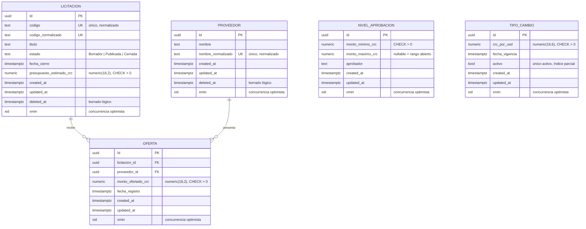

# Modelo de datos

## Diagrama entidad-relación

`NIVEL_APROBACION` y `TIPO_CAMBIO` no tienen relación de clave foránea con el resto:
el aprobador y la conversión se resuelven en tiempo de consulta (`ResolutorNivelAprobacion`,
`ConversorMoneda`) contra el monto de la mejor oferta, no mediante una FK persistida.

## Decisiones de modelado

- **Identificadores**: `Guid` generados en el dominio (`Guid.NewGuid()` en el
  constructor de cada entidad), nunca editables por el cliente ni generados por la
  base de datos, para poder crear el objeto de dominio completo antes de persistirlo.
- **Montos**: siempre `numeric(18,2)` (o `numeric(18,6)` para el tipo de cambio, que
  necesita más precisión decimal); `float`/`double` están prohibidos por el enunciado
  y no se usan en ningún DTO ni entidad.
- **Auditoría**: `created_at`/`updated_at` en las cinco entidades; `deleted_at` solo en
  `Licitacion` y `Proveedor`, que son las dos entidades con borrado lógico (`Oferta`,
  `NivelAprobacion` y `TipoCambio` se eliminan físicamente cuando corresponde, sin
  relaciones que dependan de su borrado lógico).
- **Concurrencia optimista**: en vez de una columna de versión propia, se usa la
  columna interna `xmin` de PostgreSQL (`Property<uint>("xmin").IsRowVersion()`),
  que cambia automáticamente en cada `UPDATE`. Es el mecanismo "equivalente de
  PostgreSQL" que permite el enunciado sin mantener un contador manual.
- **Índices únicos**: `codigo_normalizado` en Licitación, `nombre_normalizado` en
  Proveedor, `(licitacion_id, proveedor_id)` compuesto en Oferta, y un índice único
  **parcial** (`WHERE activo = true`) en TipoCambio para garantizar a nivel de base de
  datos que solo exista un tipo de cambio activo — la misma regla que ya valida la
  capa de aplicación, como defensa en profundidad (sección 8.3).
- **Restricciones CHECK**: presupuesto, monto ofertado, monto mínimo de aprobación y
  tipo de cambio deben ser mayores que cero, reforzado en PostgreSQL además de en
  dominio y validadores (probado explícitamente con un `INSERT` crudo en
  `MigracionesYRestriccionesTests`).
- **Claves foráneas**: `Oferta → Licitacion` y `Oferta → Proveedor` con
  `ON DELETE RESTRICT`: PostgreSQL impide borrar físicamente una licitación o un
  proveedor con ofertas relacionadas (sección 8.9), reforzando el borrado lógico que ya
  aplica la capa de aplicación.
- **Filtros de consulta globales**: `HasQueryFilter(DeletedAt == null)` en Licitación y
  Proveedor, para que ningún repositorio necesite recordar excluir registros
  eliminados lógicamente en cada consulta.

## Migraciones y datos semilla

Una única migración inicial (`InicialModeloDominio`) crea el esquema completo. Los
datos semilla (vía `HasData` en las configuraciones Fluent API, aplicados por la
migración, no en tiempo de ejecución) son:

- Tres niveles de aprobación de ejemplo (los mismos montos de la sección 8.7 del
  enunciado): Encargado de área (₡0,01–₡999 999,99), Gerencia (₡1 000 000,00–
  ₡9 999 999,99) y Junta Directiva (₡10 000 000,00 en adelante, rango abierto).
- Un tipo de cambio inicial activo (₡520 por USD) para que el sistema funcione sin
  conexión a Internet desde el primer arranque (sección 8.8).
